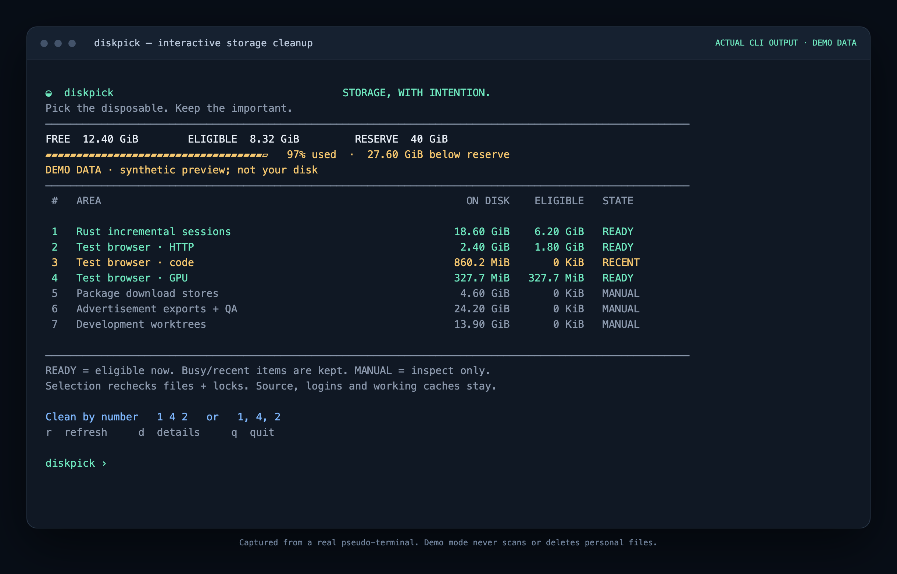
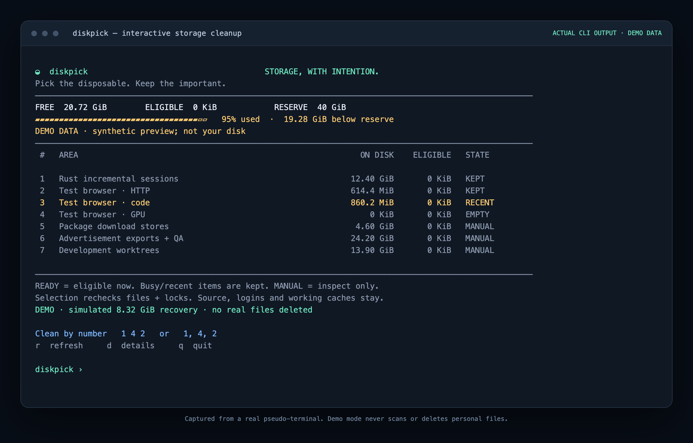

# diskpick

**Pick disposable caches. Keep the important.**

A small, dependency-free macOS terminal tool for inspecting storage and cleaning selected disposable caches. Run one command, see the areas, and enter numbers separated by spaces or commas.

```sh
diskpick
# At the prompt: 1 4, 2
```



Screenshots show **real CLI output captured from a pseudo-terminal and rendered with xterm.js**, using explicitly synthetic demo data. The demo never scans or deletes personal files.

## Install

Requires macOS, Python 3.9+, and the standard `ps` / `lsof` utilities. No runtime Python packages, package manager, network access or sudo are needed.

```sh
git clone https://github.com/MohammedElmzoudi/diskpick.git
cd diskpick
sh install.sh
diskpick
```

The installer creates `~/.local/bin/diskpick`, pointing to this folder. Keep the folder where you installed it. It does not edit your shell profile or overwrite a different existing command. If that directory is not on your PATH, use `~/.local/bin/diskpick`.

You can also run `python3 diskpick.py` directly. The whole tool lives in this one portable folder.

## Interactive controls

| Input | Action |
|---|---|
| `1 4 2` or `1,4,2` | Recheck and clean eligible contents of those areas |
| `r` | Rescan |
| `d` | Show descriptions and reasons items were kept |
| `q` | Quit |

Entering valid numbers is the cleanup instruction; there is no second confirmation. Invalid or out-of-range input rejects the whole selection. Duplicate numbers are processed once. Nothing is deleted just by launching the tool.

`READY` means something is eligible now. `RECENT`, `SKIPPED`, and `KEPT` indicate preserved contents. `SETUP` means a path needs configuring. `MANUAL` areas are **read-only inventory**, even when selected. `unknown` means the bounded inventory could not finish or access a path; it never means zero.



## What can be cleaned?

| Handler | Eligible contents | Preserved |
|---|---|---|
| Rust incremental sessions | Superseded finalized sessions at least one hour old, under configured `target/debug` directories | Newest complete session per crate/configuration, working sessions, executables, object files, dependencies and release builds |
| Test-browser HTTP/code/GPU cache | The three specific cache directories in inactive Playwright MCP profiles, untouched for 24 hours | Cookies, logins, Local Storage, IndexedDB, sessions, profiles, installed browsers and ordinary browser profiles |
| Inspect | Nothing; size/status only | Everything |

Rust paths are **not guessed**. Configure your project's `target/debug` first. Package stores are read-only by default. Worktrees, source, ads, videos, checkpoints, databases, backups, Downloads, Trash, Docker storage, OS caches, swap and updater staging are not cleanup targets.

## Add or remove areas

`diskpick config` prints the user configuration and shipped template paths. Copy the template to `~/.config/areas.json` and edit the `areas` array. The user catalog replaces the default catalog completely, so removing an entry removes it from the picker. No restart or rebuild is needed.

```json
{
  "version": 1,
  "areas": [
    {
      "id": "my-rust-cache",
      "title": "My app · compiler cache",
      "kind": "rust",
      "roots": ["~/Projects/my-app/target/debug"],
      "description": "Keep the newest cache; retire only older completed sessions."
    },
    {
      "id": "archives",
      "title": "Project archives",
      "kind": "inspect",
      "roots": ["~/Archives"],
      "description": "Read-only inventory. These files are never automatically deleted."
    }
  ]
}
```

Stable IDs are for scripts/agents; numbers are only for the current displayed list. Browser entries use `kind: "browser"` and one of `cache: "Cache"`, `"Code Cache"`, or `"GPUCache"`; their root is fixed to the Playwright MCP cache directory. Config cannot execute shell commands or introduce arbitrary recursive deletion. [Extending handlers](EXTENDING.md).

## For agents and scripts

```sh
diskpick scan --json
diskpick clean --areas browser-http,browser-gpu --yes --json
diskpick status --json
diskpick --config ./my-areas.json scan --json
```

Noninteractive cleanup requires both explicit stable IDs and `--yes`. Unknown IDs abort the entire request. Non-TTY launch scans without deleting. Cleanup rechecks eligibility rather than executing a saved stale plan. JSON results distinguish `cleaned`, `kept`, and `manual`, and include the audit path and observed net disk change.

## Safety model

This is conservative maintenance, **not a zero-risk guarantee** or a backup system. It refuses ambiguous cases instead of expanding deletion scope to reach a target.

- Existing Cargo and session locks; active compiler/open-file checks; no fake lock creation.
- Symlink-free descriptor traversal, ownership/device checks, regular files only.
- Metadata rechecks before and during removal; changed files stop that candidate.
- Failed or timed-out activity inspection keeps the candidate.
- Single cleanup instance and a flushed write-ahead audit before deletion.
- No `rm -rf`, force override, shell hooks or arbitrary-path cleanup flags.
- macOS cleanup only, as the normal user; root/sudo is refused.

Audit files are private to the user under `~/.local/state/diskpick/`. They contain paths/metadata, not file contents. Already removed disposable cache files are not rolled back if a later check fails. Cache roots and session lock files are retained. Some caches can regenerate on next use; the current Rust cache is retained to avoid wholesale rebuilds.

The 40 GiB reserve is an **informational goal**, not reserved disk blocks or a quota. Explicit selections are processed even above it. Shared blocks, APFS clones and concurrent processes mean displayed eligible sizes need not equal physical space recovered. Area sizes may overlap; on-disk totals are not added together.

Rust retention follows its [documented finalized-session and locking protocol](https://doc.rust-lang.org/nightly/nightly-rustc/rustc_incremental/persist/fs/index.html). Broader build-object and ad-evidence retirement need separate explicit policies and are intentionally not generalized from one-off cleanup scripts.

## Development

```sh
python3 -B -m unittest discover -v
diskpick --demo
python3 capture_pty.py
```

Tests use disposable temporary fixtures, including real deletion, symlink rejection, active/locked/changed-file guards, hard links, audit failure, selection parsing and configuration rejection. Screenshot rendering is optional development tooling requiring `playwright` and `@xterm/xterm`; `render_capture.cjs` turns the captured ANSI streams into PNGs. These are not runtime dependencies.

No background job, telemetry, automatic updater, or unattended cleanup is installed.

MIT licensed.
