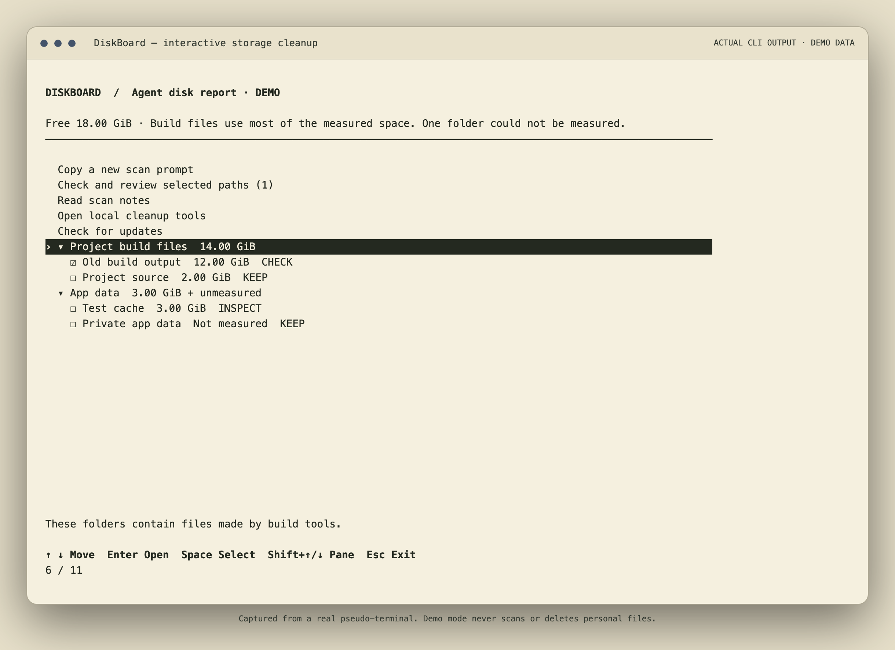
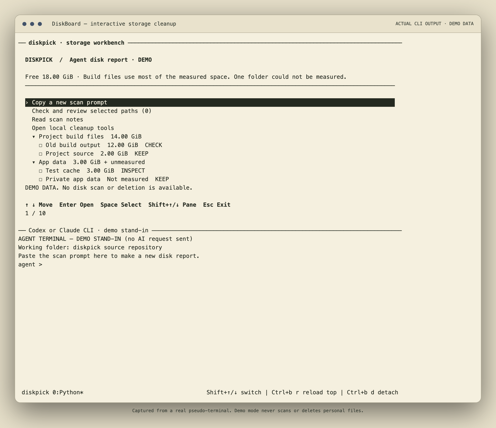

# DiskBoard — free disk cleanup review

Formerly diskpick. Use the copyable commands below, then run `diskboard`. [Update checks and automatic Git updates](UPDATES.md).

# diskpick

**Pick disposable caches. Keep the important.**

A macOS terminal app that turns a Claude or Codex disk report into a grouped storage browser. Read the explanation for each path. Select items for a local safety check. Review the exact paths before removal.

```sh
diskpick
# Arrow keys navigate; Space selects; Enter opens a review.
```



Screenshots show **real CLI output captured from a pseudo-terminal and rendered with xterm.js**, using explicitly synthetic demo data. The demo never scans or deletes personal files.

## Install

Requires macOS, Python 3.9+, and the standard `ps` / `lsof` utilities. Split panes require tmux and your chosen Claude or Codex CLI. diskpick uses PATH first. If a tool is missing from PATH, it checks common install folders and the Codex/ChatGPT app bundles. The standalone workbench requires no Python packages or network access. Agent CLIs retain their own authentication and network requirements.

For the default macOS shell (zsh), copy both lines together:

```sh
git clone https://github.com/MohammedElmzoudi/DiskBoard.git "$HOME/.local/share/DiskBoard" &&
mkdir -p "$HOME/.local/bin" && ln -s "$HOME/.local/share/DiskBoard/diskboard.py" "$HOME/.local/bin/diskboard" && printf '\nexport PATH="$HOME/.local/bin:$PATH"\n' >> "${ZDOTDIR:-$HOME}/.zshrc" && export PATH="$HOME/.local/bin:$PATH"
```

Run `diskboard` from any folder in this terminal or a new zsh terminal. These commands clone the source, create a command link, and add `~/.local/bin` to PATH in your zsh settings. They do not run an installer or use sudo. An existing destination stops setup instead of replacing files. Keep the source folder in place. For another shell, add `~/.local/bin` to that shell's PATH.

The existing `sh install.sh` option creates a launcher but does not change PATH. Internal settings and legacy commands keep their diskpick names.

## Interactive workbench

Run `diskpick`, choose **Claude CLI** or **Codex CLI**, and get two live terminals. The top pane is the report browser. The bottom pane is your agent, started in the diskpick source directory. Select **Copy a new scan prompt**. Press **Shift+Down**, paste the prompt, and send it. A complete JSON report updates the top pane automatically.

Expand groups with Enter. Use Space to select CHECK items or a group of CHECK items. Read each path, description, restore method, and evidence. Select **Check and review selected paths** to run the local checks before removal. Agent estimates never grant deletion permission. INSPECT and KEEP paths cannot be selected.

See [REPORTS.md](REPORTS.md) for the prompt, report format, limits, and safety boundary. The prompt asks for ASD-STE100 Simplified Technical English. No paid diskpick service or API key is required; your agent provider may charge for its use.

**Open local cleanup tools** keeps the existing Claude worktree and cache browsers available. Choose **Workbench only** to reach these tools without starting an agent. The worktree view groups registered `.claude/worktrees` checkouts by root repository.

1. Choose a repository.
2. Change **Unused for at least … days** (default 14).
3. Scroll oldest activity first. **Space** toggles eligible rows; **Enter** shows path, branch, activity evidence and safety reason. Page Up/Down, Home/End and supported mouse wheels scroll too.
4. Open **Review selected worktrees** to inspect just the selected list, then explicitly confirm removal. Escape cancels.

Last activity is an **estimate** based on working-file modifications, worktree Git metadata and matching local Claude session files. It is not access time and cannot prove when somebody last read a checkout. Unknown or incomplete activity inspection blocks deletion. The chosen idle-day threshold is checked again before removal.

**Staged changes, unstaged changes, untracked files, ignored local data, active processes, recent creation (under seven days), detached HEAD and protected base checkouts block retirement.** There is no force-delete option. Branches, commits and an additional Git recovery reference remain; the audit records recovery information.

The review uses your terminal's default foreground/background with reverse-video focus, so cream and dark themes remain readable. The screenshot below is a real PTY capture with synthetic data, not a report of your disk.


Cache cleanup also uses arrows, Space and a path preview. Read-only inventory remains available with `diskpick scan --json`. Initial inspection can take time on large checkouts; it never treats a failed scan as empty or safe.

## Agent workspace

- **Shift + ↑ / ↓:** switch between the top workbench and bottom agent terminal.
- **Ctrl+b, then r:** reload only the top UI after the agent changes diskpick.
- **Ctrl+b, then d:** detach while leaving the agent running. The terminal prints `diskpick --resume workspace-…` to reconnect.
- **Ctrl+b, then z:** temporarily zoom the focused pane if your terminal is small.

`diskpick --agent claude` or `diskpick --agent codex` skips the chooser. `diskpick --workbench` opens the top pane alone; use **Open local cleanup tools** without an agent. `scan`, `clean`, and JSON automation commands never start an agent.

The agent gets no automatic prompt and no extra privileges, model override, API proxy, or approval-bypass flags. The scan prompt asks for read-only work. You can separately ask the agent to edit this repository. This uses a dedicated tmux server (`diskpick-workbench`); your other tmux sessions and keybindings are not changed. Closing the top pane does not terminate the bottom agent. Exit the agent explicitly when you want it stopped; detach is not termination. A crashed/exited pane stays visible for inspection.



The screenshot shows actual tmux terminals and a **labelled demo stand-in** in the agent pane. No AI request was sent for the screenshot. Your chosen CLI runs in that pane during normal use.

## What can be cleaned?

| Handler | Eligible contents | Preserved |
|---|---|---|
| Rust incremental sessions | Superseded finalized sessions at least one hour old, under configured `target/debug` directories | Newest complete session per crate/configuration, working sessions, executables, object files, dependencies and release builds |
| Test-browser HTTP/code/GPU cache | The three specific cache directories in inactive Playwright MCP profiles, untouched for 24 hours | Cookies, logins, Local Storage, IndexedDB, sessions, profiles, installed browsers and ordinary browser profiles |
| Package downloads | Old npm, Bun, pip, Yarn and Homebrew download copies; minimum 7 days, owner idle | Installed dependencies, configuration and recent downloads |
| Generated worktree caches | Git-ignored `main/site/static/js` and `node_modules/.cache`; checkout and cache older than 7 days, idle | Source, dependencies, recent or active work |
| Retire linked checkout | Older than 7 days, idle, clean, named branch, no ignored or untracked files; interactive confirmation only | Base main worktrees, branch, commits and an extra recovery Git reference |
| Inspect | Nothing; size/status only | Everything |

Rust paths are **not guessed**. Configure your project's `target/debug` first. Download-cache presets and registered worktrees are discovered automatically. Full checkout retirement is deliberately stricter than Git: even ignored files block it. The journal records the branch and recovery ref; restore using `git worktree add <path> <branch>`. Ads, videos, checkpoints, databases, backups, personal Downloads, Trash, Docker storage, OS caches, swap and updater staging are monitoring-only or excluded.

## Add or remove areas

`diskpick config` prints the user configuration and shipped template paths. Copy the template to `~/.config/diskpick/areas.json` and edit the `areas` array. The user catalog replaces the shipped entries. Discovery adds built-in download caches, storage monitors and registered-worktree options. Add `"disabled": ["npm-downloads", "area-id"]` at the top level to hide any discovered area, or `"discovery": false` to use only your catalog. No restart or rebuild is needed.

```json
{
  "version": 1,
  "areas": [
    {
      "id": "my-rust-cache",
      "title": "My app · compiler cache",
      "kind": "rust",
      "roots": ["~/Projects/my-app/target/debug"],
      "description": "Keep the newest cache; retire only older completed sessions."
    },
    {
      "id": "archives",
      "title": "Project archives",
      "kind": "inspect",
      "roots": ["~/Archives"],
      "description": "Read-only inventory. These files are never automatically deleted."
    }
  ]
}
```

Stable IDs are for scripts/agents; numbers are only for the current displayed list. Browser entries use `kind: "browser"` and one of `cache: "Cache"`, `"Code Cache"`, or `"GPUCache"`; their root is fixed to the Playwright MCP cache directory. Config cannot execute shell commands or introduce arbitrary recursive deletion. [Extending handlers](EXTENDING.md).

## For agents and scripts

```sh
diskpick scan --json
diskpick clean --areas browser-http,browser-gpu --yes --json
diskpick status --json
diskpick --config ./my-areas.json scan --json
```

Noninteractive cleanup requires both explicit stable IDs and `--yes`. Unknown IDs abort the entire request. Non-TTY launch scans without deleting. Cleanup rechecks eligibility rather than executing a saved stale plan. JSON results distinguish `cleaned`, `kept`, and `manual`, and include the audit path and observed net disk change.

## Safety model

This is conservative maintenance, **not a zero-risk guarantee** or a backup system. It refuses ambiguous cases instead of expanding deletion scope to reach a target.

- Existing Cargo and session locks; active compiler/open-file checks; no fake lock creation.
- Symlink-free descriptor traversal, ownership/device checks, regular files only.
- Metadata rechecks before and during removal; changed files stop that candidate.
- Failed or timed-out activity inspection keeps the candidate.
- Single cleanup instance and a flushed write-ahead audit before deletion.
- No `rm -rf`, force override, shell hooks or arbitrary-path cleanup flags.
- macOS cleanup only, as the normal user; root/sudo is refused.

Audit files are private to the user under `~/.local/state/diskpick/`. They contain paths/metadata, not file contents. Already removed disposable cache files are not rolled back if a later check fails. Cache roots and session lock files are retained. Some caches can regenerate on next use; the current Rust cache is retained to avoid wholesale rebuilds.

The 40 GiB reserve is an **informational goal**, not reserved disk blocks or a quota. Explicit selections are processed even above it. Shared blocks, APFS clones and concurrent processes mean displayed eligible sizes need not equal physical space recovered. Area sizes may overlap; on-disk totals are not added together.

Rust retention follows its [documented finalized-session and locking protocol](https://doc.rust-lang.org/nightly/nightly-rustc/rustc_incremental/persist/fs/index.html). Broader build-object and ad-evidence retirement need separate explicit policies and are intentionally not generalized from one-off cleanup scripts.

## Development

```sh
python3 -B -m unittest discover -v
diskpick --demo
python3 capture_pty.py
```

Tests use disposable temporary fixtures, including real deletion, symlink rejection, active/locked/changed-file guards, hard links, audit failure, selection parsing and configuration rejection. Screenshot rendering is optional development tooling requiring `playwright` and `@xterm/xterm`; `render_capture.cjs` turns the captured ANSI streams into PNGs. These are not runtime dependencies.

No background job, telemetry, automatic updater, or unattended cleanup is installed.

MIT licensed.

The first full inventory can take a few minutes on a large developer disk. Measurements run in parallel; cleanup refreshes only selected areas. Deleting generated build caches can slow the next development launch while they regenerate. The preview calls this out; keep those areas when you need a warm startup.

## Missing CLI or PATH entry

When diskpick finds an existing tool outside PATH, it asks **Add this tool to diskpick?** Choose **Yes** to remember its exact path, **No** to go back, or **Use once** to skip saving. Multiple links to the same executable appear only once.

Yes changes only `~/.config/diskpick/tools.json`. It does not change shell files or PATH, create launcher links, install a duplicate copy, or change login settings. A saved location is checked on each launch. PATH keeps priority. The same setup flow supports tmux.

If no tool is found, choose its executable manually, open the official installation guide, check again, or return to another option. diskpick does not download or execute an installer. A missing tmux does not block the local cleanup tools.

Settings updates use a lock and atomic replacement. Symlinked, hardlinked, malformed, or busy settings are not overwritten. If saving fails, **Use once** is still available. Remove a tool entry from this diskpick-only settings file to forget it; installed software is not removed.
